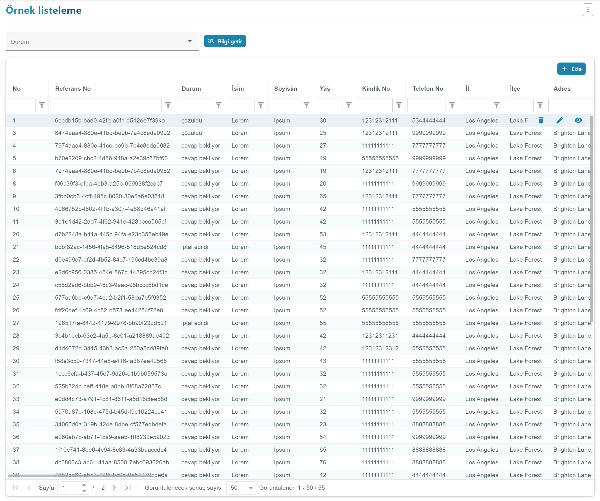
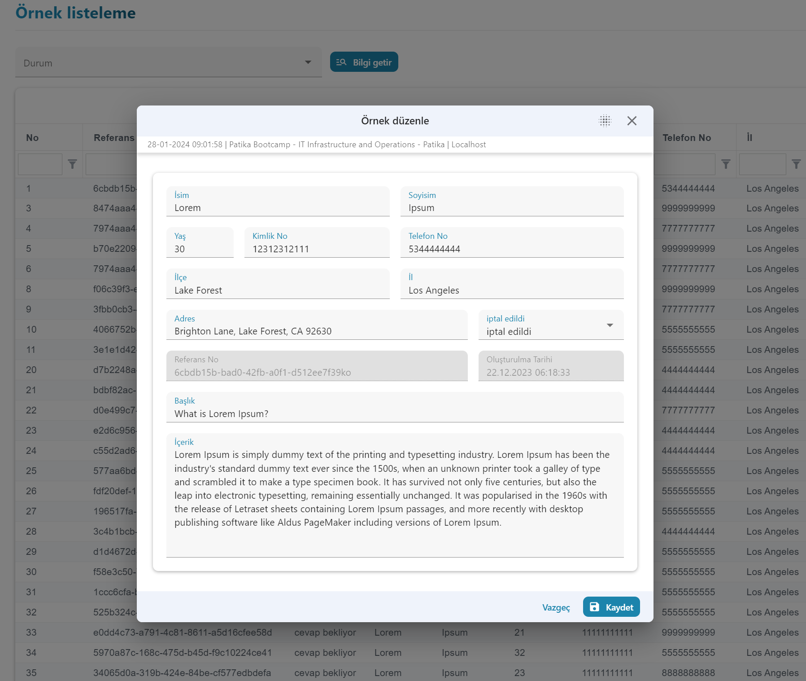
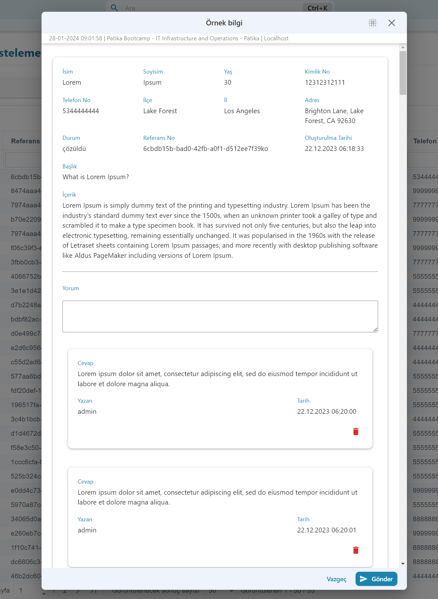
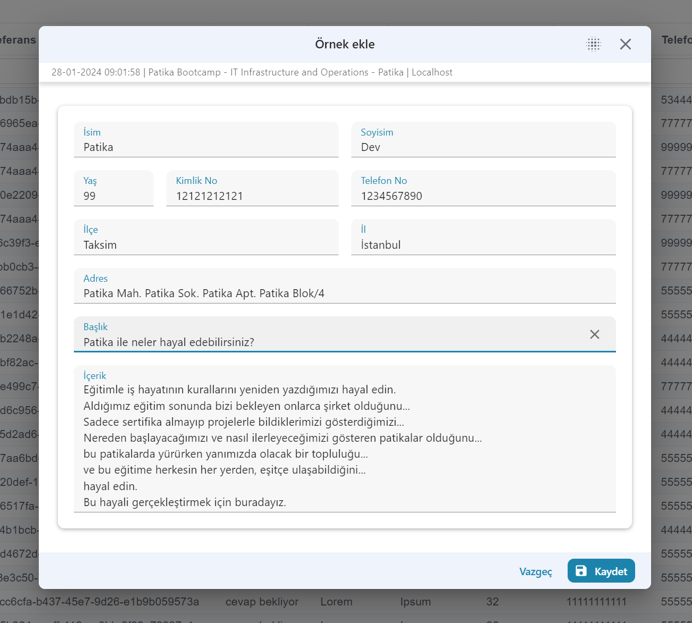
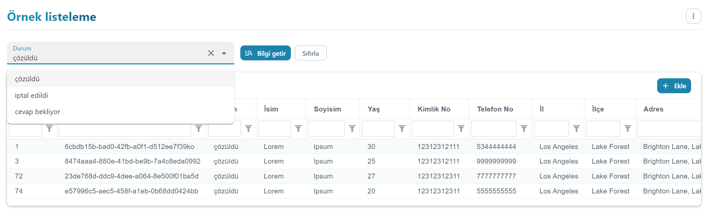
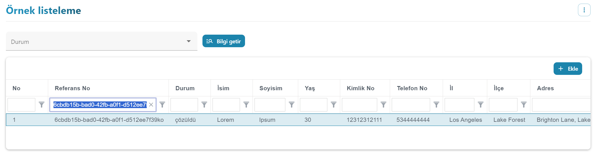

# Fimple Web Project

**Project Description:**

This project has been developed as part of the collaboration between fimple and patika for the organized bootcamp. 

It serves educational purposes and utilizes Go on the backend. The deployment is done on Fly.io. Due to being a free server and to prevent performance degradation, the server will automatically reset itself if no operations are performed within a few minutes. 

You can access the backend files by clicking on this [link](https://github.com/FakirHerif/Support-Ticket-Service/tree/main/backend) with details.

**Note:** I want to ensure transparency by stating that the backend code is entirely my own work and has not been borrowed from external sources.

**Project Features:**

- **Form Submission:** Users can submit forms, providing necessary information.
  
- **View Form Details:** Details of submitted forms can be viewed, including all relevant data.

- **Filter Data:** The system allows users to filter data based on various criteria, facilitating efficient information retrieval.

- **Update Form:** Users have the capability to update existing forms, ensuring the information is current and accurate.

- **Delete Form:** Forms that are no longer needed can be deleted from the system.

- **Commenting:** Users can add comments to forms, providing additional context or information.

- **Delete Comments:** The system supports the ability to delete comments, allowing for content management.

These functionalities aim to provide a comprehensive and user-friendly experience in managing and interacting with forms within the project.

**Additional Features:**

- **Unique UID for Each Form:** A unique UID (Unique Identifier) is generated for each form, ensuring a distinct identification for easy reference and tracking.

- **Status Tracking:** The status of each form is dynamically tracked and can be viewed as one of the following:
  - *Answered:* Indicates that the form has been responded to.
  - *Cancelled:* Indicates that the form has been cancelled.
  - *Awaiting Response:* Indicates that the form is pending a response.

These features enhance the system's capabilities by providing individual identification for each form and allowing users to track the status of forms at a glance.


### Screenshots














## _Simple and Composable Financial Platform With the “Financial Function As A Service” Principle_

## Prerequisites

- node version ^17.9.0
- yarn version ^1.22.18
- nvm version ^0.39.1 optional for managing node version

## Start and Run

In root directory,

```
`yarn` -- Install dependencies
`yarn start` -- Starts the Container(host) and all Micro Frontends with lerna
```

Navigate to _http://localhost:50000_ to start the container

## Manuel Installation

```
`yarn` -- Install dependencies
`cd saga` -- container micro frontend directory
`npm start` --  Starts the container micro frontend
```

_Web Docerizetion in local_

```
`docker build -t fi-web-base  -f Dockerfile .` -- create fi-web-base image
`docker-compose -f docker-compose.yaml up` -- build and run web docker containers
```

_Storybook Docerizetion in local_

```
`docker build -t fi-storybook-web  -f component/Dockerfile .` -- create fi-storybook-web image
`docker-compose -f docker-compose.storybook.yaml up` -- build and run storybook container
```

## Projects

| Name       | Port  |
| ---------- | ----- |
| dashboard  | 50002 |
| metadata   | 50005 |
| loan       | 50006 |
| customer   | 50007 |
| accounting | 50008 |
| deposit    | 50009 |
| saga       | 50010 |
| component  | 50011 |
| catalog    | 50012 |
| fx         | 50013 |

## New Module Creation

```shell
yarn generate-module mymodule
```
